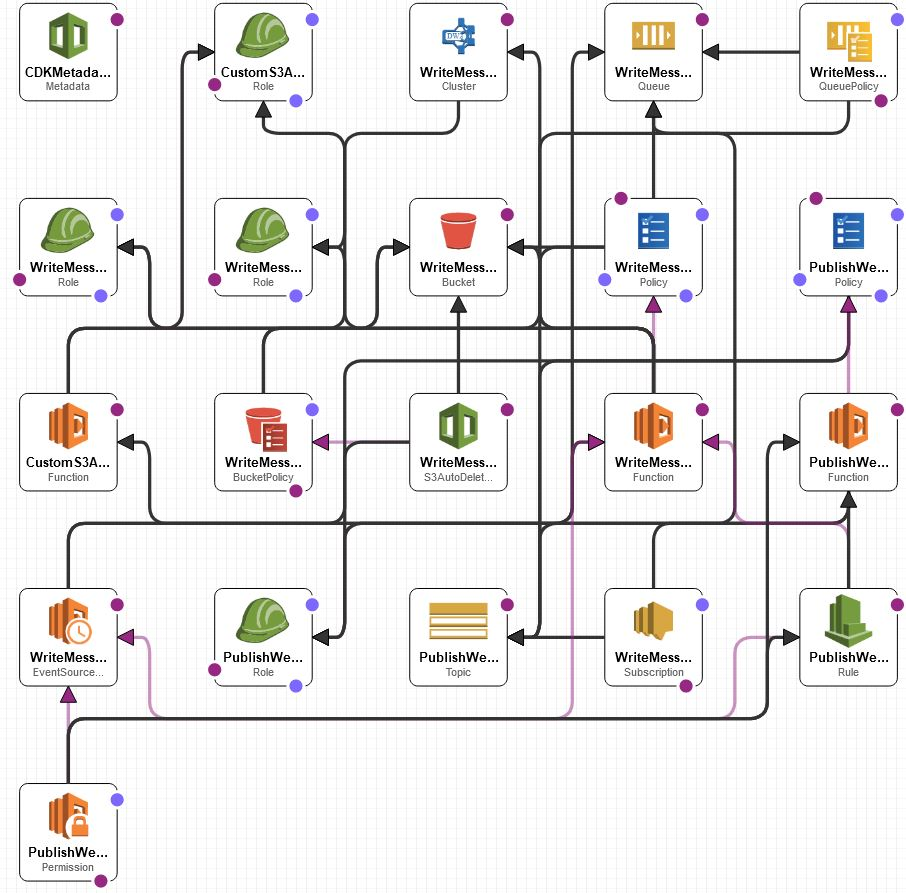

# Welcome to Web Scraping Data Pipeline!

Suppose you are ingesting large amounts of data for ad hoc analysis on a SQL data warehouse, you got big data! For Data Engineering, there are the 3 Vs: volume, velocity, variety. AWS Redshift is a suitable data warehouse for volume (massive scalability), sufficiently good velocity, and variety (can deal with JSON columns via `super`).


# Architecture
<p align="center"></p>
The architecture diagram looks quick intense. The core idea is quite simple: there is the service publishing data to a SQS queue (emulating the web scraping) and there is a service that uploads data to the Redshift data warehouse. Here are the moving parts:

* Every 1 minute, Eventbridge triggers a Lambda to load `telegram.csv` from `data-engineering-bezant-assignement-dataset.zip` in pandas DataFrame, randomly select between 1 to 1000 rows, and publish that data to a SQS queue. The purpose is to emulate the result of the web scraping process.
* The SQS queue triggers a Lambda that writes that data to a S3 bucket, calls the Redshift API via `boto3` such that Redshift loads that S3 file to a table, and then the Lambda renames that S3 file where the bucket policy will expire and delete that file after 1 day. The retention of the S3 file (instead of immediate deletion) is for debugging if something anomalous happens, you can look into the S3 file and cross reference if that data was successfully loaded in to Redshift.
* For observability, you can inspect the Lambda's Cloudwatch logs: runtime duration, failures, and count of endpoint hits. If you are fancy, you can add metrics & alarms to the Lambda (and API Gateway). For the business/operations/SRE team, you can add New Relic to the Lambda such that there will be "single pane of glass" for 24/7 monitoring. You can also inspect the API Gateway's dashboard.


## Miscellaneous details:
* `cdk.json` is basically the config file. I specified to deploy this microservice to us-east-1 (Virginia). You can change this to your region of choice.
* The following is the AWS resources deployed by CDK and thus Cloudformation. A summary would be: <p align="center"></p>
    * 1 Eventbridge rule
    * 2 Lambda functions
    * 1 SQS queue
    * 1 S3 bucket
    * 1 Redshift cluster
    * other miscellaneous AWS resources such as IAM permissions
* As always, IAM permissions and VPC security groups are the trickiest parts.
* In production, I would have a DLQ for the SQS queue such that failed messages are not reprocessed forever. Also I would add monitoring metrics everywhere to inform me when something breaks.


# Deploying the Microservice Yourself
```
$ python -m venv .venv
$ source .venv/bin/activate
$ python -m pip install -r requirements.txt
$ cdk deploy  # Docker daemon must be running; also assumes AWS CLI is configured + npm installed with `aws-cdk`: detailed instructions at https://cdkworkshop.com/15-prerequisites.html
```